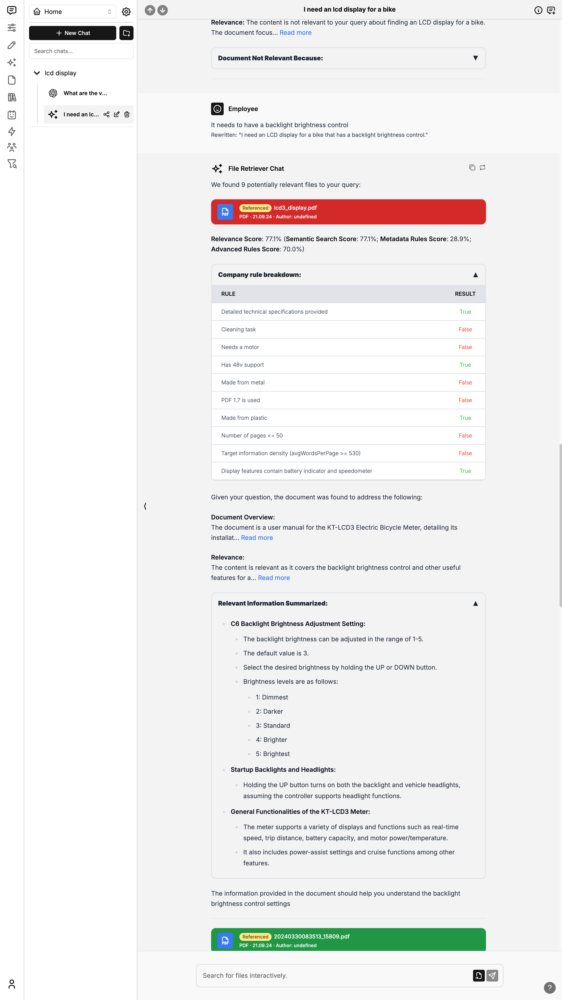
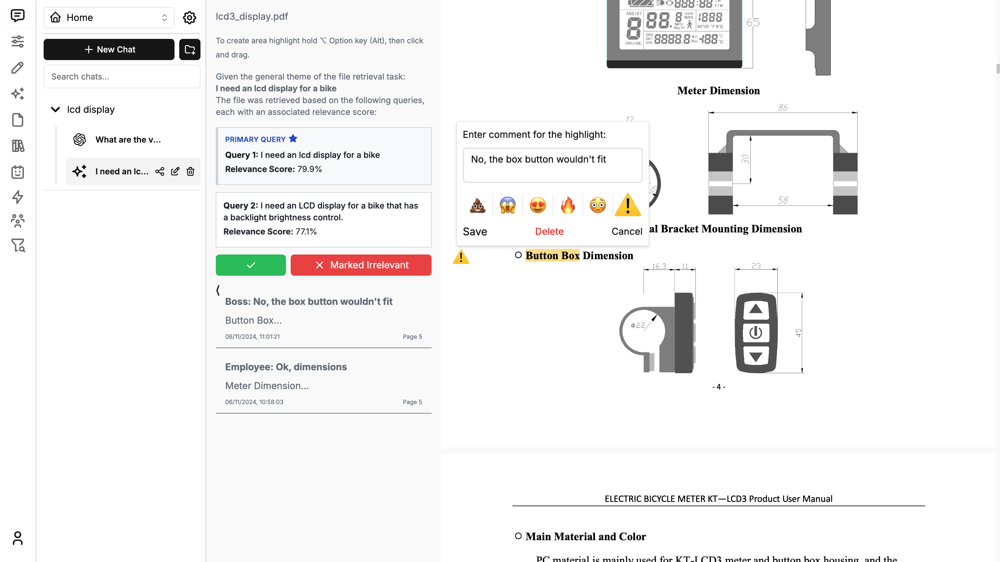

# DokuHarmonie 

My bachelor thesis's UI based on Chatbot UI with focus on data quality and team collaboration.




Follow these steps to get it running!

### 1. Clone the Repo

```bash
git clone https://github.com/konstantintuev/thesis-ui.git
```

### 2. Install Dependencies

Open a terminal in the root directory of your local DokuHarmonie repository and run:

```bash
npm install
```

### 3. Install Supabase

#### 1. Install Docker

You will need to install Docker to run Supabase locally. You can download it [here](https://docs.docker.com/get-docker) for free.

#### 2. Install Supabase CLI

**MacOS/Linux**

```bash
brew install supabase/tap/supabase
```

**Windows**

```bash
scoop bucket add supabase https://github.com/supabase/scoop-bucket.git
scoop install supabase
```

### 3. Fill in Secrets

#### 1. Create a new project

Go to [Supabase](https://supabase.com/) and create a new project.

#### 2. Get Project Values

In the supabase dashboard fetch the following:

- `Project URL`: Found in "API Settings" as "Project URL"

- `Anon key`: Found in "Project API keys" as "anon public"

- `Service role key`: Found in "Project API keys" as "service_role" (Reminder: Treat this like a password!)

#### 3. Configure Auth

Next, click on the "Authentication" icon tab on the far left.

In the text tabs, click on "Providers" and make sure "Email" is enabled.

#### 4. Connect to Hosted DB

Open up your repository for your hosted instance of DokuHarmonie.

In the 1st migration file `supabase/migrations/20240108234540_setup.sql` you will need to replace 2 values with the values you got above:

- `project_url` (line 53): Use the `Project URL` value from above
- `service_role_key` (line 54): Use the `Service role key` value from above

Create an env file:

```bash
cp .env.local.example .env.hosted
```
In environment variables, add the following from the values you got above:

- `NEXT_PUBLIC_SUPABASE_URL`
- `NEXT_PUBLIC_SUPABASE_ANON_KEY`
- `SUPABASE_SERVICE_ROLE_KEY`

Now, open a terminal in the root directory of your local DokuHarmonie repository. We will execute a few commands here.

Login to Supabase by running:

```bash
supabase login
```

Next, link your project by running the following command with the "Project ID" you got above:

```bash
supabase link --project-ref <project-id>
```

Your project should now be linked.

Finally, push your database to Supabase by running:

```bash
supabase db push
```

Your hosted database should now be set up!

You can also add API keys as environment variables.

- `OPENAI_API_KEY`
- `AZURE_OPENAI_API_KEY`
- `AZURE_OPENAI_ENDPOINT`
- `AZURE_GPT_45_VISION_NAME`

For the full list of environment variables, refer to the '.env.local.example' file. If the environment variables are set for API keys, it will disable the input in the user settings.

Make sure that the ML server is accessible and the LAN url to `ML_SERVER_URL` in the env file is correct:
[ML Server](https://github.com/konstantintuev/thesis_backend.git)

### 4. Run app

In your terminal at the root of your DokuHarmonie repository, run:

```bash
npm run dev:hosted
```

Your local instance of DokuHarmonie should now be running at [http://localhost:3000](http://localhost:3000). Be sure to
use a compatible node version (i.e. v18).
